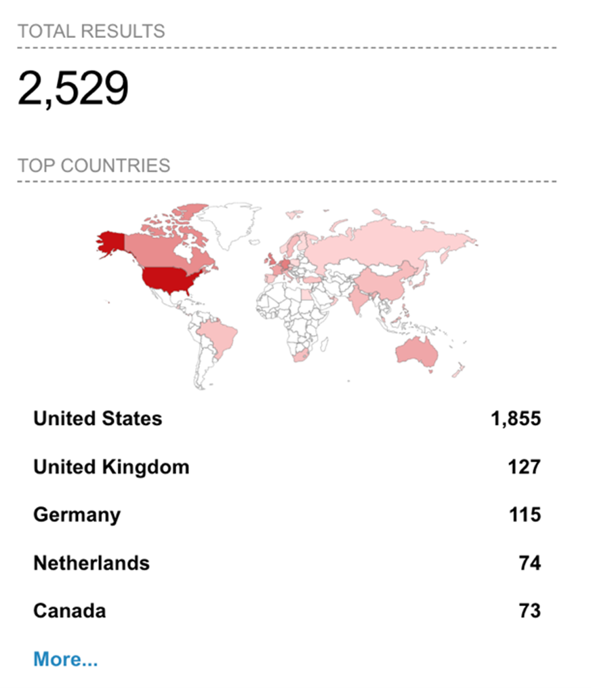

<br/>
<p align="center">
  <a href="https://github.com/errorfiathck">
    
  </a>

  <h3 align="center">MOVEit Exploit</h3>

  <p align="center">
    an exploit of POC for CVE-2023-34362 affecting MOVEit Transfer
    <br/>
    Note this project is done...
    <br/>
    <br/>
    <!-- <a href="https://readme.shaankhan.dev"><strong>View Demo »</strong></a> -->
    <br/>
    <br/>
    <a href="https://intsagram.com/error._.fiat">Our instagram page</a>
    .
    <a href="https://youtube.com/error_fiat">Our youtube chanel</a>
    .
    <a href="https://twitter.com/ErrorFiat">Our twitter page</a>
  </p>
</p>

# CVE-2023-34362
POC for CVE-2023-34362 affecting MOVEit Transfer

## Disclaimer
This software has been created purely for the purposes of academic research and for the development of effective defensive techniques, and is not intended to be used to attack systems except where explicitly authorized. Project maintainers are not responsible or liable for misuse of the software. Use responsibly.

## Summary

This POC abuses an SQL injection to obtain a sysadmin API access token and then use that access to abuse a deserialization call to obtain remote code execution.

This POC needs to reach out to an Identity Provider endpoint which hosts proper RS256 certificates used to forge arbitrary user tokens - by default this POC uses our IDP endpoint hosted in AWS.

By default, the exploit will write a file to C:\Windows\Temp\message.txt. Alternative payloads can be generated by using the ysoserial.net project.


## CVE-2023-34362 – MOVEit Transfer – An attack chain that retrieves sensitive information

MOVEit Transfer is a popular secure file transfer solution developed by Progress, a subsidiary of Ipswitch. At the moment, there are more than 2,500 MOVEit Transfer servers that are accessible from the internet, according to Shodan.



On May 31, 2023, Progress released a security advisory affecting versions 2021.0.6 (13.0.6), 2021.1.4 (13.1.4), 2022.0.4 (14.0.4), 2022.1.5 (14.1.5), 2023.0.1 (15.0.1).

The vulnerability is categorized as a SQL injection allowing an unauthenticated user access to MOVEit databases, potentially resulting in arbitrary code execution and data exfiltration.

The attack chain begins with a SQL injection that retrieves administrative credentials, allowing unrestricted file upload that attackers can use to install a backdoor on the server. 

On Friday, June 1, 2023, the CVE was added to the CISA Known Exploited Vulnerabilities list (KEV), indicating that this is a critical vulnerability and is currently being exploited in the wild.

A proof of concept (PoC) has not been released. However, after further investigation, the Imperva Threat Research team created effective and dedicated mitigation rules for this vulnerability to strengthen the existing built-in mitigation against SQL injection attacks that have already detected the attack. CVE-2023-34362 is mitigated by both Imperva Cloud WAF, WAF Gateway and RASP.

Over the past few days, Imperva Threat Research observed thousands of exploitation attempts, all successfully thwarted by Imperva Cloud WAF and Imperva WAF Gateway (customer-managed WAF). Most exploitation attempts were carried out by automated hacking tools written in various scripting languages, such as Python via the requests module and Bash via the CURL tool. The main industries targeted by this CVE are financial services and healthcare.

The Imperva Threat Research Team observed exploitation attempts coming from these IPs:

51[.]158[.]122[.]21

51[.]15[.]218[.]116

196[.]112[.]216[.]184

67[.]220[.]86[.]236

51[.]15[.]199[.]148

158[.]247[.]208[.]44

50[.]19[.]142[.]233

It’s also important to note that these IPs had a high-risk score based on the Imperva IP Reputation mechanism. This suggests that the IPs were actively participating in malicious activity in recent days. 

As always, Imperva​​ Threat Research is closely monitoring the situation and will provide updates as new information emerges.

## About The Project


an exploit of POC for CVE-2023-34362 affecting MOVEit Transfer

## Built With

Whilst I was the main developer of this project, this project couldn't of even started without the help of these open source projects, special thanks to:

- [[Python]](https://www.python.org/)

## Getting Started

This is an example of how you may give instructions on setting up your project locally.
To get a local copy up and running follow these simple example steps.

### Prerequisites

This program has no pre-requisites

### Installation & Usage

1. Clone the repo

```sh
git clone https://github.com/ShaanCoding/ReadME-Generator.git
```

2. cd to directory

```sh
cd MOVEit-Exploit
```
3. run the script as example:
```sh
python3 CVE-2023-34362.py https://127.0.0.1
[*] Getting sysadmin access token
[*] Got access token
[*] Getting FolderID
[*] Got FolderID: 963611079
[*] Starting file upload
[*] Got FileID: 965943963
[*] Injecting the payload
[*] Payload injected
[*] Triggering payload via resume call
[+] Triggered the payload!
[*] Deleting uploaded file
```

4. Have fun!